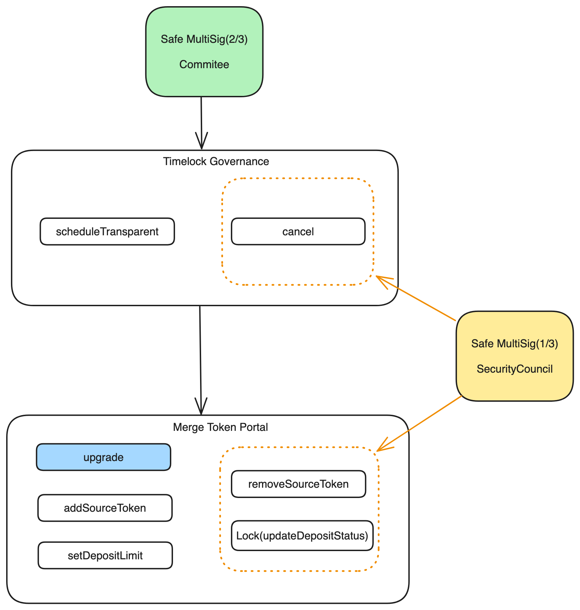

# [ZkLink L3 Contracts](https://zk.link/)

## Install Dependencies

`npm install`

## Compile contracts

`npx hardhat compile`

## Run tests

Run all unit tests:

`npx hardhat test`

## Governance
### Architecture

## Development

For developers, static analysis need to be done before committing code. Read more of [SecurityCheck](docs/SecurityCheck.md).
